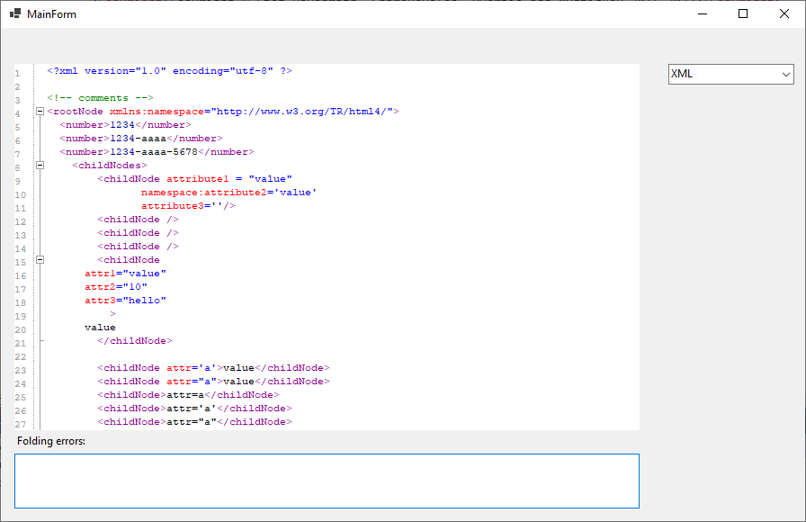

# ICSharpCode.TextEditorEx

Extended version based on ICSharpCode.TextEditor which supports

* .NET 4.0., .NET 5.0-windows, .NET 6.0-windows and .NET 8.0-windows
* search and replace
* go to linenumber
* Lua, SQL and Json Syntax highlighting
* XML folding and CSharp folding
* ContextMenu : Cut,Copy,Paste,Select All, Redo and Undo
* Several enhancements

## Example

